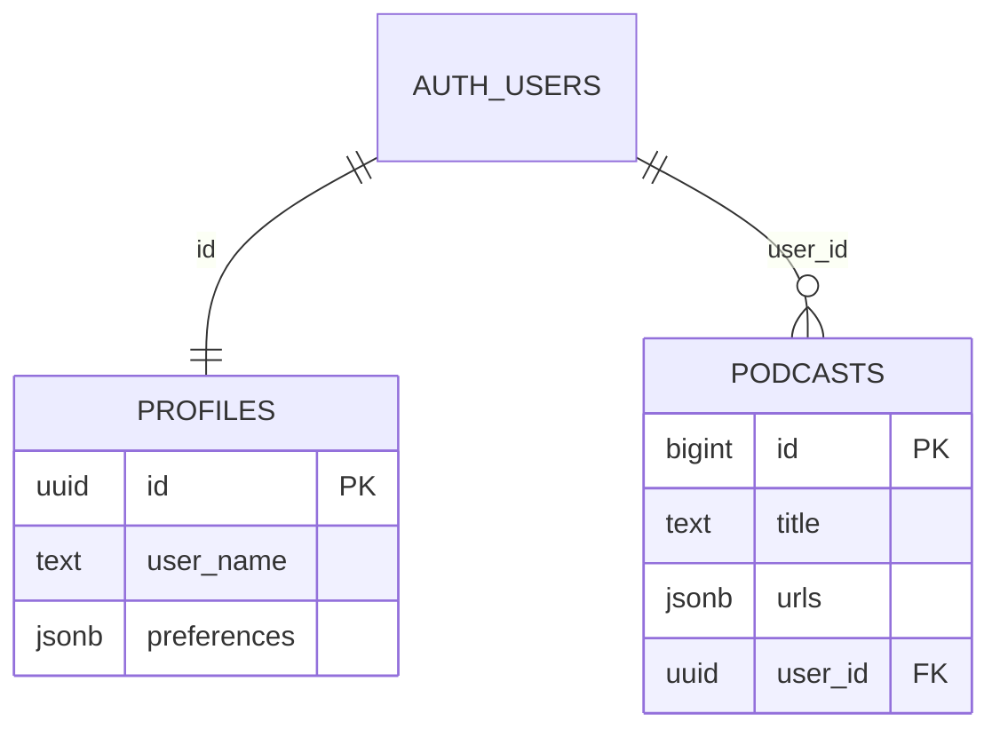

# Supabase Schema
## Tables

### `public.profiles`

| Column | Type | Notes |
|---|---|---|
| `id` | `uuid` | PK, user identifier (matches `auth.users.id`) |
| `user_name` | `text` | user name |
| `preferences` | `jsonb` | includes `preferred_hosts` |

`preferences` example:

```json
{
  "preferred_hosts": ["sarah_curious", "mike_expert"]
}
```

### `public.podcasts`

| Column | Type | Notes |
|---|---|---|
| `id` | `bigint` | PK (identity) |
| `title` | `text` | podcast topic/title |
| `urls` | `jsonb` | output artifact URLs |
| `user_id` | `uuid` | FK to `auth.users.id` |

`urls` example:

```json
{
  "audio": "https://...",
  "transcript": "https://..."
}
```

## Relationships (visual)



## Buckets

| Item | Value |
|---|---|
| Bucket name | `SUPABASE_STORAGE_BUCKET` (from environment) |
| Path pattern | `{user_id}/{task_id}/{file_name}` |
| Upload mode | `upsert = true` |
| URL type | Public URL (`get_public_url`) |

Example object path:

```text
2f6e.../9a13.../transcript.vtt
```

## Trigger

- On `auth.users` insert, a default `profiles` row is created automatically.
